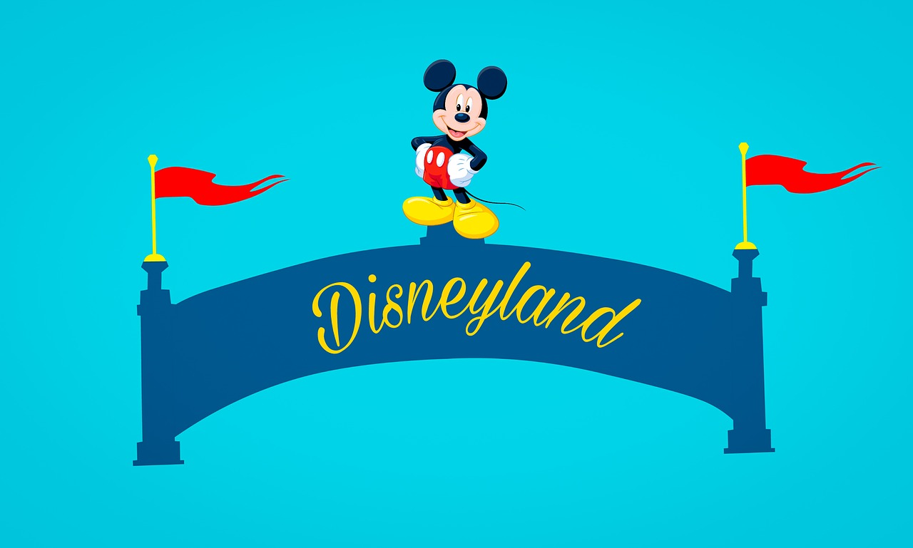

# DisneyPinNewsAPI

The **Disney Pin News API** will gather you the latest news that is currently going on in the community. This API will respond to you in JSON and provide the headline, publish date, description, image, and more. The best part is that the information will always stay *up to date* 

## Rate Limit

The **Disney Pin News API** is an open source API. No current limit has been enforced but will be added by the next version. Since 500 dino-hours are given, approximently less that 300 requests a day. 

## Getting Started

These instructions will get help you make a call to the API to retrieve the information. See instructions for notes on how to request the project on a your own personal project.

## Authentication
You may use [Postman](https://www.getpostman.com/) to *Sign In* and *Log In* to the API

*Routes*

**POST url** __https://disney-pin-news-api.herokuapp.com/sign-up__

### User Schema

| Key         | Type         | Description                                                           |
|-------------|--------------|-----------------------------------------------------------------------|
| Username    |    string    | The username                                                          |
| Password    |    string    | The user's password                                                   |

**POST url** __https://disney-pin-news-api.herokuapp.com/login__

*Same as User Schema*

### Requests to get articles

Retrive **ONE** of the latest news in Disney Pins.

**GET url** __https://disney-pin-news-api.herokuapp.com/api/news/:id__

```JSON
        {
            "_id": "5c81f924d39f83001786cff9",
            "title": "The UnDiscovered Future World Pin",
            "date": "2019-03-06T00:00:00.000Z",
            "description": "We recently attended the UnDISCOVERed Future World Tour at Walt Disney World. On this tour you learn about Walt Disney’s original idea for Epcot, how the park has evolved and explore backstage areas! All guests receive a pin that we want to share with you.It features a monorail, Spaceship Earth and reads: The UnDISCOVERed Future World. Pin-on-pin design and it is an open edition. It can only be obtained by attending the tour.Some of our favorite parts were seeing the HP Lounge above Mission: Space attraction, walking through the costuming department at Epcot, and seeing the construction for the new Space restaurant behind Test Track!We highly recommend this tour if you’re a fan of Walt Disney history and Epcot. Click here to learn more.-Disney Pins Blog",
            "picture": "https://disneypinsblog.com/wp-content/uploads/2019/03/The-UnDiscovered-Future-World-Pin.jpg",
            "pictureDescription": "The UnDiscovered Future World Pin"
        }
```

Retrive **ALL** the latest news in Disney Pins.

**GET url** __https://disney-pin-news-api.herokuapp.com/api/news__
```JSON
        {
            "title": "Mardi Gras 2019 WDI Pin",
            "date": "2019-03-04T08:00:00.000Z",
            "description": "Surprise pin release! Here is a look at 2019 Mardi Gras pin at Mickey’s of Glendale! Retail price is $24.95 and the LE size is 250. Available only to Disney Cast Members.This pin features Naveen, Tiana & Louis from Disney’s Princess and the Frog. Click here to view the Mickey’s of Glendale pin category.-Disney Pins Blog",
            "picture": "https://disneypinsblog.com/wp-content/uploads/2019/03/Mardi-Gras-2019-WDI-Pin.jpg",
            "pictureDescription": "Mardi Gras 2019 WDI Pin"
        },
        {
            "_id": "5c80546c302eec8ca9c6d1b5",
            "title": "Disneyland Paris March 2019 Pins",
            "date": "2019-02-28T08:00:00.000Z",
            "description": "Here is a look at the March 2019 pin releases at DLP. This month includes Captain Marvel, St. Patrick’s Day, Princesses Day and more!Click here to view all Disneyland Paris pins.-Disney Pins Blog",
            "picture": "https://disneypinsblog.com/wp-content/uploads/2019/02/Disneyland-Paris-March-2019-Pins-724x1024.jpg",
            "pictureDescription": "Disneyland Paris March 2019 Pins",
        },
        {
            "_id": "5c80545b302eec8ca9c6d174",
            "title": "New Disney Pins February 2019 Week 2",
            "date": "2019-02-10T08:00:00.000Z",
            "description": "Here is a look at the new pin releases this week at Disney Parks.In case you missed it:DPB Community | DPB Podcast| DPBStore.com-Disney Pins Blog",
            "picture": "https://disneypinsblog.com/wp-content/uploads/2019/02/Anaheim-Ducks-Day-2019-Disney-Pin-1.png",
            "pictureDescription": "Anaheim Ducks Day 2019 Disney PinAladdin Kingdom Consoles PinPresidents’ Day 2019 Disney PinWinnie the Pooh Balloon PinMarie Lady Disney PinGadget Hackwrench Disney PinMuppet Babies Disney PinPua and Hei Hei Disney Pin",
        },
```
**AND CONTINUES TO UPDATE**

Update **ONE** of the articles

**PUT url**  __https://disney-pin-news-api.herokuapp.com/api/news/:id__
*You can update a news article with the schema below*

### Article Schema

| Key         | Type         | Description                                                           |
|-------------|--------------|-----------------------------------------------------------------------|
| Title       |    string    | The Articles's title                                                  |
| Date        |     Date     | The Articles's date                                                   |
| Description |    string    | The Articles's description                                            |
| Picture     |  string(url) | The Articles's picture in a url                                       |
| Pic. Desc.  |    string    | The Articles's picture description                                    |

## Comments
Post a Comment on a News article

**POST url** __https://disney-pin-news-api.herokuapp.com/api/news/:id/comments__

| Key         | Type         | Description                                                           |
|-------------|--------------|-----------------------------------------------------------------------|
| Comment     |    string    | The Articles's Comments                                               |

Get a Comment on a News article

**GET url** __https://disney-pin-news-api.herokuapp.com/api/news/:id/comments/:commentId__
```JSON
        {
            "_id": "5c7f66fe72ee977a089b9560",
            "comment": "This is a great article! Would read"
        }
```


## Web Extension Suggestion
**Chrome** - [JSON Formatter - Chrome](https://chrome.google.com/webstore/detail/json-formatter/bcjindcccaagfpapjjmafapmmgkkhgoa?hl=en) - JSON Formatter for Chrome

**Safari** - [JSON Formatter - Safari](https://safari-extensions.apple.com/details/?id=com.marcdonkers.asinijsonviewer) - JSON Formatter for Safari

## Client Libraries

* [Node.js](https://nodejs.org/dist/latest-v11.x/docs/api/) - Javascript Runtime
* [Express.js](https://expressjs.com/) - Web framework for Node.js
* [MongoDB](https://www.mongodb.com/) - Non Relational Database
* [Cheerio](https://cheerio.js.org/) - Web Scrapper
* [Axios](https://www.npmjs.com/package/axios) - Promise based HTTP client for the browser and node.js

## Authors

* **Ryan Nguyen** - *Initial work* - [Disney Pin News API](https://github.com/GirugaCode/Disney-Pin-New-API)

## License

This project is licensed under the MIT License - see the [LICENSE.md](LICENSE.md) file for details

## Acknowledgments

* Make School Staff and TAs for assisting me on this project
* My involvment in the hobbie of Disney Pins
* The magic of Web Scrapping